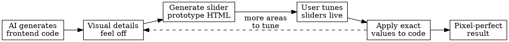

# Vibe Frontend Design — Interactive Slider Tuning

## Overview

**Core principle:** Don't fight AI with words when you can tune with sliders.

AI coding tools produce frontend with "almost right" spacing, alignment, and typography — close enough to ship, annoying enough to bother detail-oriented users. Repeatedly prompting "make the padding smaller" or "reduce the font size" is slow, imprecise, and frustrating.

**The fix:** Generate an interactive HTML prototype where all visual parameters are adjustable sliders. User tunes in real-time, then feeds exact values back to apply.

## When to Use

- AI-generated frontend has spacing/alignment/font issues
- User is a "detail person" unhappy with visual rough edges
- Repeated prompt-based tweaking isn't converging
- User wants pixel-perfect control over specific UI parameters
- Any time visual fine-tuning is needed after initial implementation

**When NOT to use:**
- Layout/structure problems (wrong component hierarchy) — fix architecture first
- Color scheme changes — direct prompting works fine for this
- Functional bugs — not a visual tuning problem

## The Technique



### Step 1: Identify What Feels Off

Before generating the prototype, identify which parameters need tuning. Common categories:

| Category | Typical Parameters |
|----------|-------------------|
| **Spacing** | padding, margin, gap, section spacing |
| **Typography** | font-size, line-height, letter-spacing, font-weight |
| **Alignment** | text-align, justify-content, align-items, position offsets |
| **Sizing** | width, height, max-width, border-radius |
| **Visual** | opacity, box-shadow blur/spread, border-width |

### Step 2: Generate the Slider Prototype

Ask Claude to create an interactive HTML page:

> "帮我做一个 HTML 页面可交互原型，把 [目标组件/页面] 的所有视觉参数变成可调节的滑杆，我要实时预览效果"

The generated HTML should include:
- **Live preview area** — renders the actual component/layout
- **Slider panel** — one slider per tunable parameter, with:
  - Current value display
  - Sensible min/max range
  - Real-time binding (input event, no submit button)
- **Export button** — copies all current values as CSS variables or a JSON object

Example slider prototype structure:

```html
<!-- Claude generates something like this -->
<div id="preview">
  <!-- The actual UI component rendered here -->
</div>

<div id="controls">
  <label>Title Font Size: <span id="v-title-fs">24</span>px
    <input type="range" min="12" max="48" value="24"
           oninput="updateParam('--title-fs', this.value + 'px')">
  </label>
  <label>Card Padding: <span id="v-card-pad">16</span>px
    <input type="range" min="4" max="40" value="16"
           oninput="updateParam('--card-pad', this.value + 'px')">
  </label>
  <!-- ... more sliders ... -->
  <button onclick="exportValues()">Copy Parameters</button>
</div>
```

### Step 3: User Tunes Parameters

Open the HTML file in browser. User adjusts sliders until satisfied.

**Tips for the user:**
- Start with spacing (biggest visual impact)
- Then typography (font-size and line-height together)
- Fine-tune alignment last
- Use the export button to capture all final values

### Step 4: Apply Values Back

User pastes the exported values back to Claude. Claude applies them to the actual codebase — CSS variables, Tailwind config, or inline styles, depending on the project setup.

## Prompt Templates

**Full page tuning:**
> "帮我做一个可交互 HTML 原型，把这个页面的间距、字体大小、行高、圆角等视觉参数全部做成滑杆，实时预览效果"

**Single component tuning:**
> "把这个卡片组件做成可交互原型，所有 padding、margin、font-size、border-radius 做成滑杆"

**After tuning:**
> "这是调好的参数：[paste exported values]，请应用到实际代码中"

## Advanced: Scoped Tuning

For complex pages, generate multiple focused prototypes instead of one giant one:
1. **Header/Nav prototype** — logo size, nav spacing, height
2. **Content area prototype** — text columns, card grid gaps, section padding  
3. **Component prototype** — individual card/button/form styling

This keeps each prototype manageable and focused.

## Common Mistakes

| Mistake | Fix |
|---------|-----|
| Putting ALL parameters in one prototype | Scope to one section/component at a time |
| Slider range too narrow | Use generous ranges (e.g., font-size 8-72px) |
| No real-time preview | Must use `oninput`, not `onchange` |
| Forgetting to export values | Always include a copy/export button |
| Tuning before fixing layout bugs | Fix structural issues first, tune visual details after |
